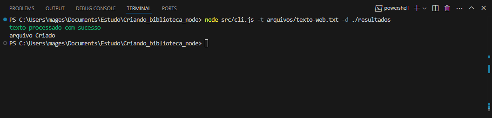
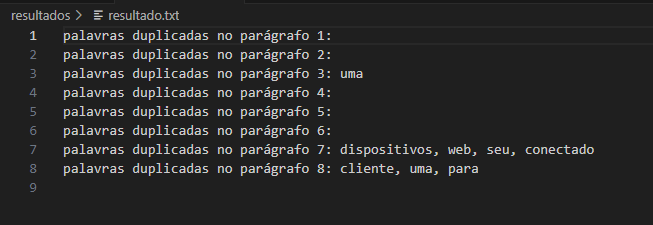

# 📚 Biblioteca de Contagem de Palavras

## 👨‍🎓 Criado durante o curso da Alura: [JavaScript com Node.js: criando sua primeira biblioteca](https://cursos.alura.com.br/user/mageskylms/course/javascript-node-js-criando-primeira-biblioteca/certificate)

---

## 📖 Descrição

Essa biblioteca em **Node.js** processa arquivos de texto, identifica palavras duplicadas em cada parágrafo e gera um arquivo com os resultados encontrados. Ideal para quem precisa de uma forma simples de detectar repetições em documentos e fazer análises rápidas sobre o conteúdo textual.

---

## 🚀 Funcionalidades

- **Contagem de Palavras Duplicadas:** Analisa parágrafos de um arquivo de texto e identifica palavras repetidas.
- **Geração de Arquivo de Resultados:** Cria um arquivo `resultado.txt` contendo as palavras duplicadas encontradas.
- **Tratamento de Erros:** Captura erros comuns, como arquivos inexistentes ou caminhos inválidos.

---

## 🛠 Requisitos

- **Node.js:** Certifique-se de ter o Node.js instalado em sua máquina.
- **Pacotes Necessários:** Instale as dependências para garantir que o projeto funcione corretamente, como `commander` e `chalk`.

---

## 🔧 Instalação

1. Clone este repositório:

   ```bash
   git clone https://github.com/mageskylms/nome-do-repositorio.git
   ```

2. Navegue até o diretório do projeto:

   ```bash
   cd nome-do-repositorio
   ```

3. Instale as dependências:

   ```bash
   npm install
   ```

4. Certifique-se de que os pacotes **commander** e **chalk** estão instalados. Caso contrário, instale-os manualmente:

   ```bash
   npm install commander chalk
   ```

   - **commander:** Facilita o uso de argumentos na linha de comando.
   - **chalk:** Permite colorir e formatar mensagens no terminal.

---

## 🏃‍♂️ Como Usar

Execute o script pela linha de comando, utilizando os seguintes parâmetros obrigatórios:

- **--texto** ou **-t:** Caminho do arquivo de texto a ser processado.
- **--destino** ou **-d:** Caminho da pasta onde o arquivo de resultados será salvo.

### 📌 Exemplo de Uso

```bash
node cli.js --texto ./arquivos/texto-web.txt --destino ./resultados
```

### 🔍 Explicação dos Parâmetros

- **--texto (-t):** Caminho do arquivo de texto a ser processado (exemplo: `./arquivos/texto-web.txt`).
- **--destino (-d):** Diretório onde o arquivo `resultado.txt` será salvo (exemplo: `./resultados`).

### ✅ Saída Esperada

Se o processamento for bem-sucedido, você verá a mensagem:

```
Texto processado com sucesso
```

O arquivo `resultado.txt` será criado no diretório especificado, contendo as palavras duplicadas encontradas em cada parágrafo.

---

## 🗂 Estrutura do Projeto

- **src/cli.js:** Ponto de entrada da aplicação. Responsável por receber os argumentos da linha de comando e iniciar o processamento.
- **src/index.js:** Contém a lógica principal para contagem de palavras.
- **src/helpers.js:** Funções auxiliares para filtrar ocorrências e montar a saída do arquivo.
- **erros/funcoesErro.js:** Funções para tratamento de erros.
- **resultados:** Diretório para armazenar o arquivo final de resultados.
- **package.json:** Arquivo de configuração do projeto.

---

## 📦 Dependências

- **commander:** Manipulação de argumentos da linha de comando.
- **chalk:** Exibição colorida de mensagens no terminal.

---

## 💡 Contribuição

Contribuições são bem-vindas! Fique à vontade para abrir **issues** e **pull requests**. Se você tem uma ideia ou encontrou algo que pode ser melhorado, adoraremos ver sua contribuição!

---

## 📝 Licença

Este projeto está licenciado sob a [MIT License](./LICENSE).

---

### 📸 Screenshots





---

**Sinta-se à vontade para explorar e aprimorar essa biblioteca!** 😎
